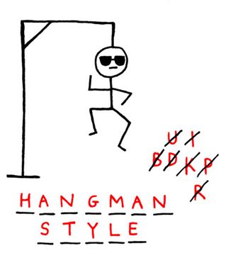

# Project Title - Hangman: A Classic Word guessing Game in Python

Hangman is a classic word guessing game where the computer randomly choices a word and the player tries to guess that word within a certain amount of attempts.

This is an implementation of the Hangman game, where the computer thinks of a word and the user tries to guess it.

## Table of Contents
1. Introduction (# Project Title)
2. Project Description (## Project Description)
3. Installation Instructions (## Installation instructions)
4. Usage Instructions (## Usage instructions)
5. License Information (## License information)

## Project Description
In the classic children's game of Hangman, a player's objective is to identify a secret word of which only the number of letters is originally revealed. In each round, the player guesses a letter of the alphabet: if it is present in the secret word, all instances are revealed; otherwise one of the hangman's body parts is drawn in on a gallows. The game ends in a win if the word is entirely revealed by correct guesses, and ends in a loss if the hangman's body is completely revealed instead. To assist the player, a visible record of all guessed letters is typically maintained.
Built in sections -
    Part 1 - Milestone_2.py
        - Defined the list of possible words
        - Choose a random word from the list
        - Asked the Player for an input
        - Check that the input is a single character
        - Documented to this point
        - Updated GitHub with commits and git push
        - Refactored and optimised current code
    
    Part 2 - Milestone_3.py
        - Iterately checked the player input to make sure a valid guess
        - Checked whether the player_guess was in the random_selected_word
        - Created functions to help run the checks - check if valid & is in the random_selected_word

    Part 3 - Milestone_4.py - converting to OOP paradigm.
        - Create the Game class
        - Create Hangman class
        - Create __init__ method passing word_list and num_lives=5 parameters
        - Initialise following attributes -  randon_word, word_guessed, num_letters, num_lives, word_list and list_of_guesses
        - Create methods for running the checks of input valid and guess is or not in word
        - Define what happens if the letter is in the word using for-loop and if statements
        - Define what happens if the letter is NOT in the word

## Installation instructions
    To install the game, you need to have Python 3 installed on your system. You can download it from [here](https://www.python.org/downloads/).

Then, you can clone this repository or download the zip file. To clone the repository, run the following command:

''' bash
git clone https://github.com/MTabrett/hangman_game_project.git
import random
run milestone_2.py to start the game

## Usage instructions
    To play the game, navigate to the project directory and run the milestone_2.py file:

## License information
MIT license